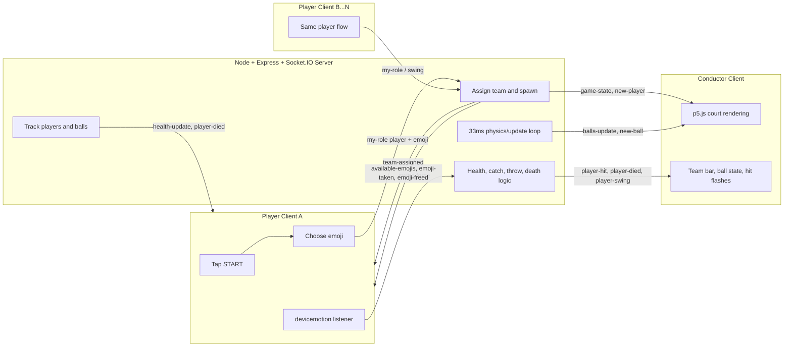

Punch is a virtual dodgeball game played with phones and a shared screen. Players swing their phones to catch and throw balls, turning simple body movement into a fun group experience.

## Abstract

Punch takes the basic idea of dodgeball and moves it into a virtual shared space. Instead of trying to make a realistic sports simulation, the project focuses on play, movement, and social energy. Each player joins with a phone, but the game really comes alive on the larger shared screen where everyone can see the action together. Simple visuals, emoji characters, and motion-based input make the game easy to understand from a distance. The project is about how small gestures from individual players can create a larger group performance made of competition, timing, misses, catches, and collaboration.

<div style="margin: 2rem 0;">
  <video controls preload="metadata" playsinline style="width: 100%; border-radius: 0.75rem;">
    <source src="https://res.cloudinary.com/leow/video/upload/v1773653796/blog/abc-project-1_etx7hs.mp4" type="video/mp4" />
    Your browser does not support the video tag.
  </video>
</div>

## Design and Composition

The first idea for this project was to make a Nintendo Sports-like game using motion data from a mobile phone. I wanted to track the path of a gesture with accelerometer and orientation data so different movements could trigger different actions. In practice, that was hard to do well. The sensor data was noisy, phones behaved differently, and the interaction became harder to control than expected.

That problem led to the main design decision of the project: fewer actions made a better experience. Instead of trying to detect many kinds of gestures, I reduced the game to one main action, the swing. That made the game easier to learn, easier to read, and more reliable to run. The project moved away from detailed sports simulation and became a simpler shared dodgeball experience.

Once I accepted that simpler interaction, the visual design also became clearer. I reduced the game to a few key elements: a court, two team colors, ball icons, and emoji players. This made the game easy to understand for both players and people watching.

One of the most important decisions was splitting the project into two screens. The phone works as a simple controller, while the larger conductor screen shows the whole game. On the phone, the player only sees the essentials: start, emoji, team color, and health. On the main screen, everyone can see the court, the teams, the balls, and the hit effects. This made the project feel more public and social.

I also made a few design changes to improve the play experience. Players are spawned with spacing between them so they do not overlap. Catching uses a visible ring and a forgiving radius, because a very strict collision system felt frustrating. Held balls orbit around the player so possession is always visible on the shared screen.

The simpler the phone interface became, the better the project felt. Instead of buttons or many gesture types, the player only needs one action: swing to catch and swing to throw. This made the body movement itself the main interaction and kept the game easy to join.

The strongest part of the final version is the balance between game and performance. Even if players do not know all the rules at first, they can still understand the team structure, the motion, and the effects on screen. The project works as both a game and a public group event.

## Technical Details

Technically, Punch is a small real-time multiplayer web app built with Express and Socket.IO. The server serves the static files, runs over HTTPS, and handles real-time communication. HTTPS is important because mobile motion input needs a secure context.

There are three main roles in the system:

1. The Node/Express server manages player state, team assignment, physics, health, and ball logic.
2. The player client runs on a phone and listens for `devicemotion` events to detect swing intensity.
3. The conductor client renders the whole game state in p5.js and acts as the public visual layer.

The player-side logic is simple. When a player taps START, the app asks for motion permission, shows the emoji picker, and joins the game as a player. After that, the phone listens for acceleration data. If the movement is strong enough, the client sends a `swing` event to the server.

```js
let mag = Math.sqrt(x * x + y * y + z * z);

if (mag > SWING_THRESHOLD && canSwing) {
  let force = Math.min(mag / FORCE_MAX, 1);
  socket.emit("swing", { force: force });
}
```

On the server, the same `swing` event does two jobs. If the player is holding a ball, the swing throws it. If the player is not holding a ball, the swing tries to catch the closest ball nearby. This was an important design choice because one gesture could support the whole game.

The server runs an update loop every 33 milliseconds. In that loop it moves the balls, handles bouncing, updates orbiting balls, and checks for hits. A hit happens when a moving ball passes through a player's area without being caught. When that happens, the player loses health.

```js
if (inside && !ball.nearPlayers[player.id]) {
  ball.nearPlayers[player.id] = true;
} else if (!inside && ball.nearPlayers[player.id]) {
  delete ball.nearPlayers[player.id];
  player.health--;
}
```

The conductor screen is built with p5.js. It does not run the game logic itself. Instead, it receives updates from the server and draws the court, players, balls, team bars, and hit effects. This keeps the game logic in one place and makes the shared screen easier to manage.

### Socket.IO Information Flow



### Technical Challenges

One technical challenge was calibrating motion input. Phone motion data is noisy and different devices behave differently, so the game uses a threshold, a cooldown, and a capped force value. Another challenge was keeping the shared screen easy to read. The final system uses simple physics and simple visuals so the interaction stays clear.

The earlier plan to trace more detailed gesture paths from accelerometer and orientation data shaped the whole project. That idea was too unreliable for this prototype. It needed more filtering and calibration, and it did not actually make the game better. The better solution was to redesign the system around a smaller set of actions that the phone could detect more reliably.

If I rebuilt this project, I would improve calibration and onboarding first. I would add a short tutorial, clearer feedback for catching and missing, and better explanation of how hard to swing. I would also add sound, stronger animation, and more polished state syncing for larger groups.

## Reflection

The project changed from a broad motion-game idea into a clearer installation format: phones as controllers, a shared screen as the stage, and dodgeball as the main structure. This made the project much easier to understand and join.

What works best is the relationship between individual movement and the shared public image. A small gesture on one phone changes the whole game space. What I am less satisfied with is how much the experience still depends on phone sensitivity and player intuition.

The main feedback I received was that the game did not always make it clear what players were supposed to do, especially when joining for the first time. The pace also becomes too fast when a lot of players join, making the screen harder to read and the game harder to follow. Another issue was the lack of feedback when a player interacted with a ball — catching, missing, or successfully throwing did not always feel clear enough. This feedback pointed to three important areas for improvement: onboarding, scaling, and feedback. In response, I would improve the introduction with clearer instructions and stronger visual cues, rebalance the game when more players are present, and add stronger audiovisual feedback for catches, misses, and throws.

## References

- [Socket.IO documentation](https://socket.io/docs/v4/)
- [Express static file serving](https://expressjs.com/en/starter/static-files.html)
- [p5.js reference](https://p5js.org/reference/)
- [MDN DeviceMotionEvent](https://developer.mozilla.org/en-US/docs/Web/API/DeviceMotionEvent)
